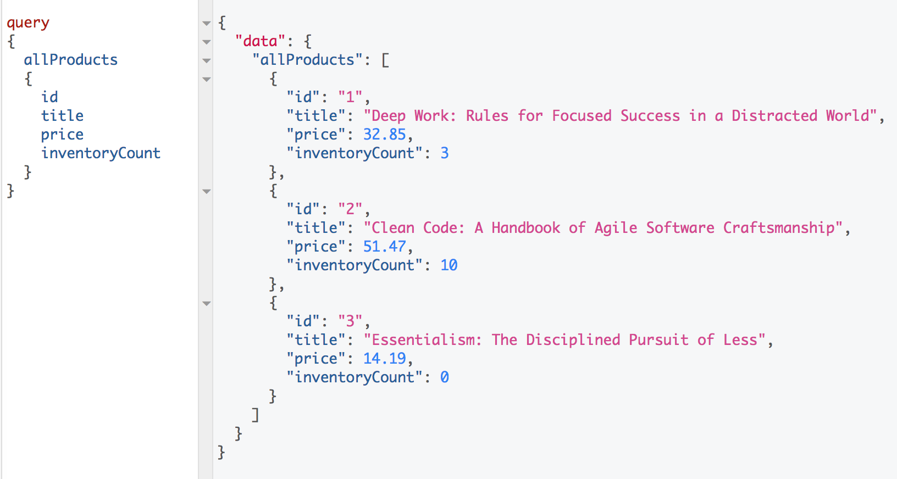
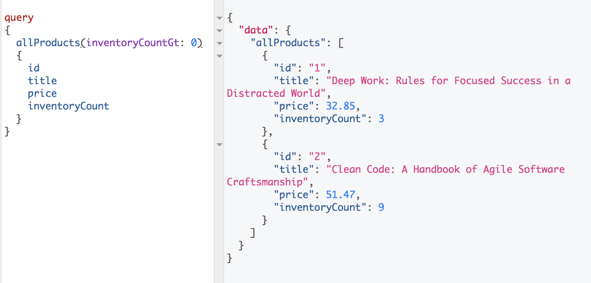
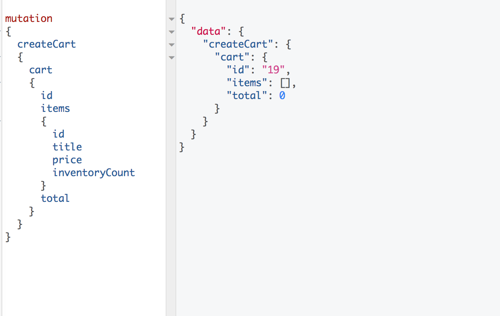
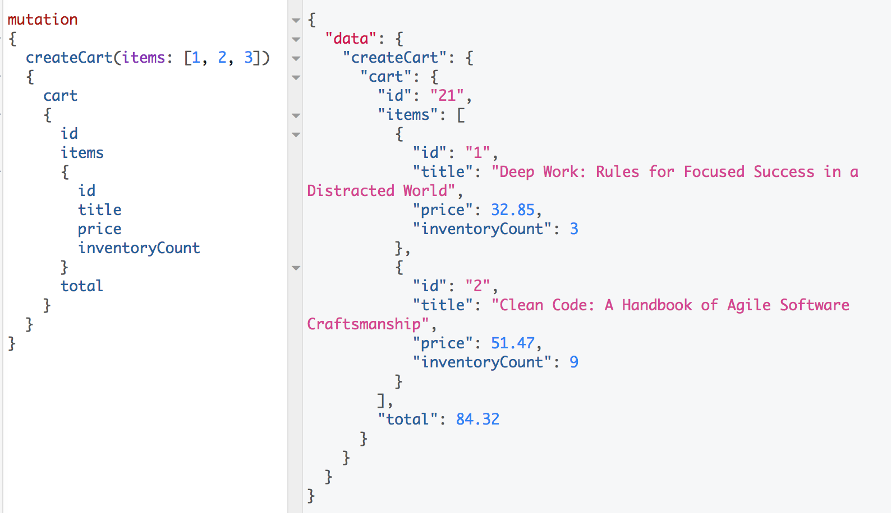
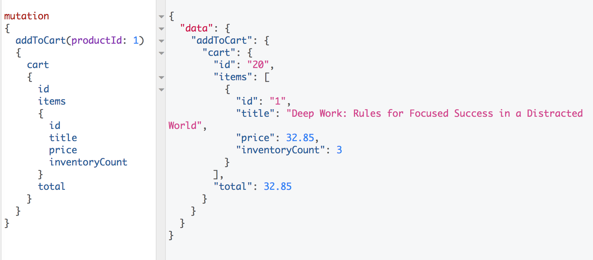
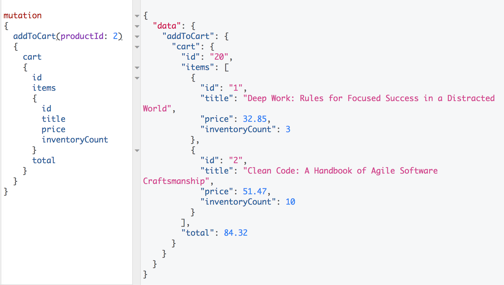
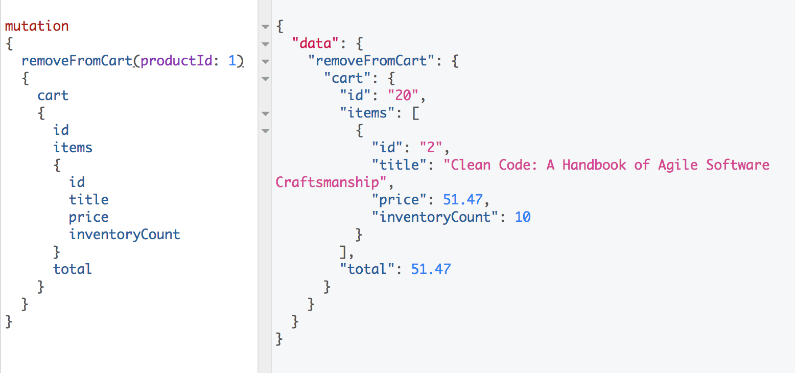
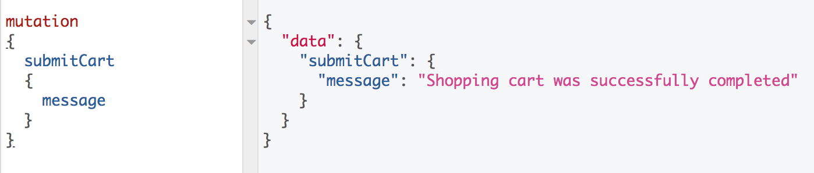
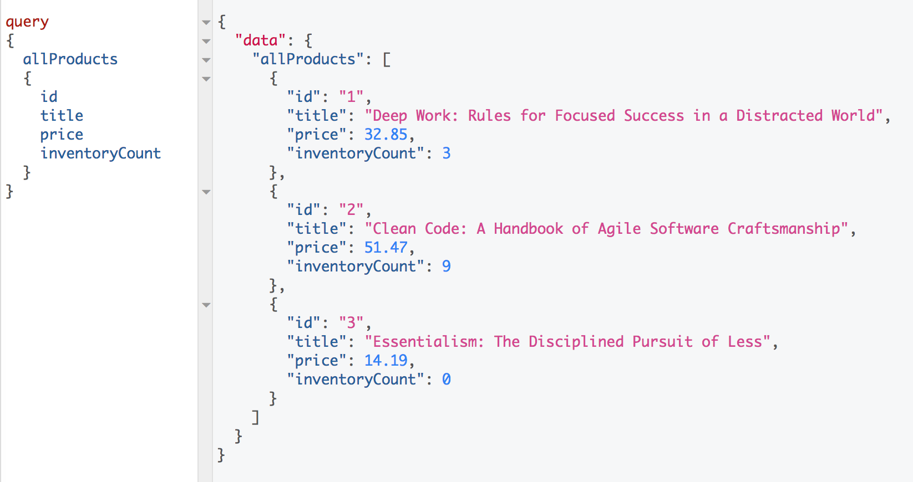

# Django GraphQL Shopping Cart API

Unit tests can be found at products/tests.py and shoppingCart/tests.py. You can run all tests in the project's root with:

``` pipenv run python manage.py test -v 2 ```

## How to Run ##
<em>Note: Python 3 is required for this project</em>
1. Clone or download this repository
2. Change directory to one with Pipfile ('/shopify' - project root)
3. Install all project dependencies with pipenv

    ``` pipenv install ```
4. If you don't want to make your own products you can load pre-defined test data

    ``` pipenv run python manage.py loaddata data/sample.json```
5. Run django server

    ``` pipenv run python manage.py runserver ```
6. Go to localhost:8000/graphiql on browser to use built-in GraphQL GUI or make requests directly to localhost:8000/
<br><br>

## Use Cases ##
Below are some of the use cases this API supports. I've also included a [postman collection](./postman/GraphQL_Shopping_Cart.postman_collection.json) in the root of this project with example requests.
<br><br>

### Query for all Products ###
<em>Search all products in database</em>


<br><br>

### Query for all Products with Available Inventory ###
<em>Search all products with inventory greater than 0</em>


<br><br>

### Create Empty Cart ###
<em>Create shopping cart if none in current session</em>



### Create Cart with Products ###
<em>Create shopping cart initialized with 3 items (item 3 has no inventory)</em>


<br><br>

### Add Product to Cart ###
<em>Add product with id 1 (deep work) to shopping cart</em>


<br><br>

### Add Extra Products to Cart ###
<em>Add one more product to shopping cart (clean code)</em>


<br><br>

### Remove from Cart ###
<em>Remove product from shopping cart (deep work)</em>


<br><br>

### Complete Cart ###
<em>Complete cart in current session</em>



<em>Products in db after submission</em>


<br><br>
